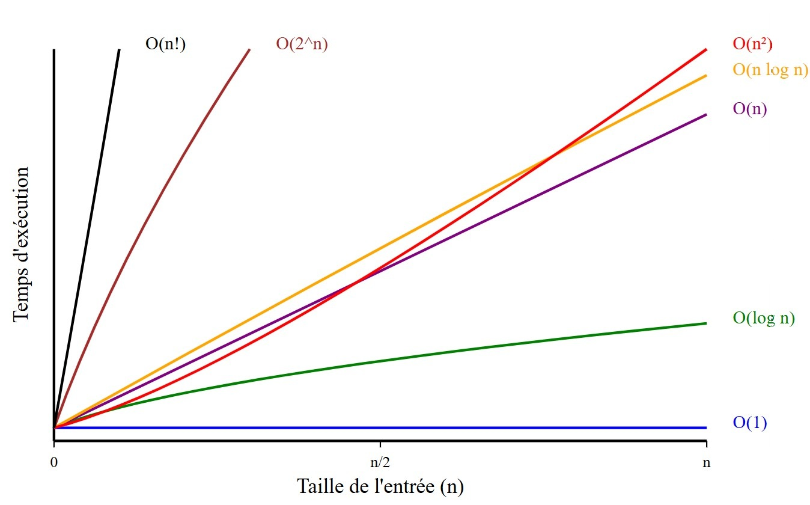

# Ordre de Grandeur des Fonctions

L'ordre de grandeur des fonctions décrit la manière dont une fonction se comporte en fonction de la taille de l'entrée (notée **n**). En d'autres termes, cela montre comment le temps d'exécution ou la mémoire utilisée augmente avec **n**. Voici un tableau des principaux ordres de grandeur, du plus lent au plus rapide :

## 1. O(1) – Complexité constante
**Description** : Le temps d'exécution est indépendant de la taille de l'entrée. Il ne varie pas quelle que soit la valeur de **n**.  
**Exemple** : Accéder à un élément dans un tableau par son indice.
```javascript
function getElementAtIndex(arr, index) {
    return arr[index];  // Temps constant
}

let arr = [1, 2, 3, 4, 5];
console.log(getElementAtIndex(arr, 2));  // Affiche 3
```
## 2. O(log n) – Complexité logarithmique
**Description** : Le temps d'exécution croît logarithmiquement avec la taille de l'entrée. Cela signifie que la taille du problème est divisée en sous-problèmes à chaque étape (par exemple, la recherche binaire).  
**Exemple** : Recherche binaire dans un tableau trié.
```javascript
function binarySearch(arr, target) {
    let left = 0, right = arr.length - 1;
    while (left <= right) {
        const mid = Math.floor((left + right) / 2);
        if (arr[mid] === target) return mid;
        if (arr[mid] < target) left = mid + 1;
        else right = mid - 1;
    }
    return -1;  // Élément non trouvé
}

let arr = [1, 2, 3, 4, 5, 6, 7, 8, 9];
console.log(binarySearch(arr, 5));  // Affiche 4 (index de 5)
```
## 3. O(n) – Complexité linéaire
**Description** : Le temps d'exécution est directement proportionnel à la taille de l'entrée. Si vous avez un tableau de taille **n**, l'algorithme effectuera **n** opérations.  
**Exemple** : Parcourir un tableau pour afficher chaque élément.
```javascript
function printElements(arr) {
    for (let i = 0; i < arr.length; i++) {
        console.log(arr[i]);  // Temps linéaire
    }
}

let arr = [1, 2, 3, 4, 5];
printElements(arr);  // Affiche 1, 2, 3, 4, 5
```

## 4. O(n log n) – Complexité linéaire-logarithmique
**Description** : Le temps d'exécution croît linéairement à chaque niveau d'un processus logarithmique. Cela se produit souvent dans les algorithmes de tri efficaces.  
**Exemple** : Tri par fusion (MergeSort), tri rapide (QuickSort).
```javascript
function mergeSort(arr) {
    if (arr.length <= 1) return arr;
    const mid = Math.floor(arr.length / 2);
    const left = mergeSort(arr.slice(0, mid));
    const right = mergeSort(arr.slice(mid));
    return merge(left, right);
}

function merge(left, right) {
    let result = [], i = 0, j = 0;
    while (i < left.length && j < right.length) {
        if (left[i] < right[j]) result.push(left[i++]);
        else result.push(right[j++]);
    }
    return result.concat(left.slice(i), right.slice(j));
}

let arr = [5, 3, 8, 4, 2];
console.log(mergeSort(arr));  // Affiche [2, 3, 4, 5, 8]

```
 
## 5. O(n²) – Complexité quadratique
**Description** : Le temps d'exécution croît proportionnellement au carré de la taille de l'entrée. Cela signifie que pour chaque élément, on effectue une opération pour chaque autre élément.  
**Exemple** : Tri par insertion, tri à bulles, recherche d'une paire d'éléments dans un tableau à deux boucles imbriquées.
```javascript
function bubbleSort(arr) {
    let n = arr.length;
    for (let i = 0; i < n - 1; i++) {
        for (let j = 0; j < n - i - 1; j++) {
            if (arr[j] > arr[j + 1]) {
                [arr[j], arr[j + 1]] = [arr[j + 1], arr[j]];  // Échange
            }
        }
    }
}

let arr = [5, 3, 8, 4, 2];
bubbleSort(arr);
console.log(arr);  // Affiche [2, 3, 4, 5, 8]
```

## 6. O(2^n) – Complexité exponentielle
**Description** : Le temps d'exécution double à chaque ajout d'élément à l'entrée. Cela peut rapidement devenir très coûteux même pour des valeurs relativement petites de **n**.  
**Exemple** : Résolution de certains problèmes de combinatoire, comme le problème du voyageur de commerce avec une approche brute-force.
```javascript
function fibonacci(n) {
    if (n <= 1) return n;
    return fibonacci(n - 1) + fibonacci(n - 2);  // Temps exponentiel
}

console.log(fibonacci(5));  // Affiche 5
```


## 7. O(n!) – Complexité factorielle
**Description** : Le temps d'exécution croît de manière extrêmement rapide avec la taille de l'entrée, multipliant les possibilités de manière factorielle. Cela survient souvent dans des algorithmes qui doivent tester toutes les permutations possibles d'un ensemble d'éléments.  
**Exemple** : Résolution brute du problème du voyageur de commerce en examinant toutes les permutations possibles des villes.
```javascript
function getAllPermutations(arr) {
    if (arr.length === 0) return [[]];
    let result = [];
    for (let i = 0; i < arr.length; i++) {
        let current = arr[i];
        let remaining = arr.slice(0, i).concat(arr.slice(i + 1));
        let permutations = getAllPermutations(remaining);
        for (let perm of permutations) {
            result.push([current].concat(perm));
        }
    }
    return result;  // Génère toutes les permutations
}

let arr = [1, 2, 3];
console.log(getAllPermutations(arr));  // Affiche toutes les permutations de [1, 2, 3]
```


## Tableau récapitulatif des ordres de grandeur

| Complexité  | Description                                    | Exemple                                |
|-------------|------------------------------------------------|----------------------------------------|
| **O(1)**    | Temps constant, ne dépend pas de **n**         | Accéder à un élément dans un tableau   |
| **O(log n)**| Logarithmique, divise l'espace de recherche    | Recherche binaire dans un tableau trié|
| **O(n)**    | Linéaire, proportionnel à **n**                | Parcourir un tableau                   |
| **O(n log n)**| Linéaire-logarithmique, courant dans les tris| MergeSort, QuickSort                   |
| **O(n²)**   | Quadratique, souvent dans les algorithmes à boucles imbriquées | Tri à bulles, tri par insertion        |
| **O(2^n)**  | Exponentielle, double à chaque ajout d'élément | Problèmes combinatoires (ex. voyageur de commerce) |
| **O(n!)**   | Factorielle, très coûteuse                     | Recherche brute de permutations        |
# Représentation graphique des complexités

## Légende du graphique:

- **Bleu** - _O(1)_ : Complexité constante
- **Vert** - _O(log n)_ : Complexité logarithmique
- **Violet** - _O(n)_ : Complexité linéaire
- **Orange** - _O(n log n)_ : Complexité linéaire-logarithmique
- **Rouge** - _O(n²)_ : Complexité quadratique
- **Marron** - _O(2^n)_ : Complexité exponentielle
- **Noir** - _O(n!)_ : Complexité factorielle

Cette visualisation permet de comparer facilement les différentes complexités algorithmiques et leur impact sur les performances lorsque la taille des données augmente.

## Conclusion

- **O(1)** est optimal (temps constant).
- **O(log n)** et **O(n)** sont efficaces pour des tailles de données modérées.
- **O(n log n)** est idéal pour les algorithmes de tri.
- **O(n²)** et plus sont généralement considérés comme inefficaces pour des tailles de données importantes.
- Les complexités **O(2^n)** et **O(n!)** croissent très rapidement, rendant l'algorithme inutilisable pour de grandes tailles de données.